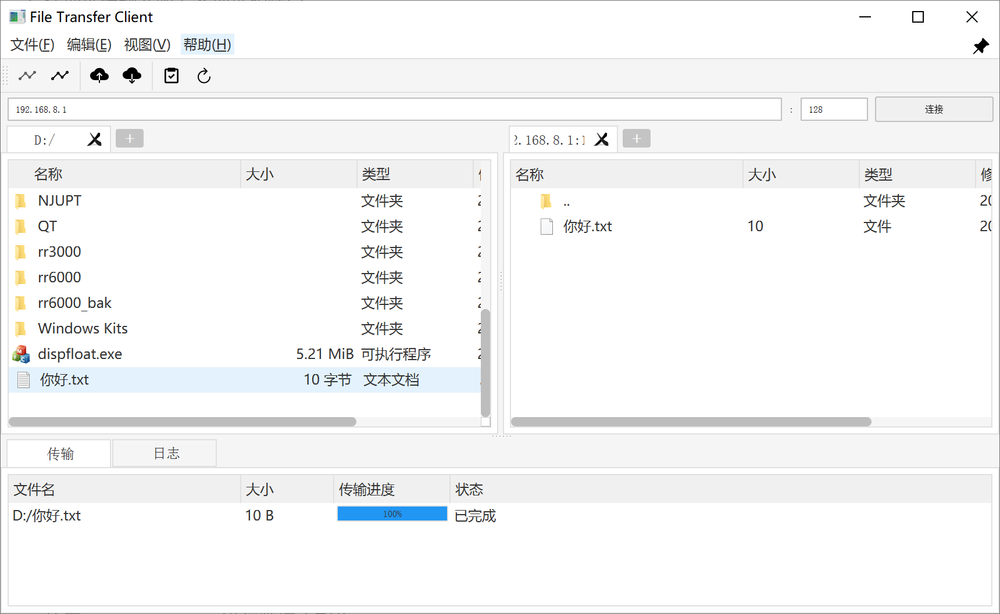

# 文件传输客户端

## 项目简介
这是一个基于Qt开发的跨平台文件传输客户端,类似于Xftp的实现。项目旨在提供一个简单易用、功能完整的文件传输解决方案。

主要特点:
- 跨平台支持(Windows/Linux)
- 界面简洁直观
- 支持文件上传、下载和对本地文件操作
- 支持浅色/深色主题

当前状态: Beta版本

## 功能特性
- 服务器管理
  - 多标签页浏览不同服务器
  - 记住常用服务器配置
  - 支持快速重连
- 文件传输
  - 支持文件/文件夹上传下载
  - 传输速度限制
  - 实时进度显示
  - 传输历史记录
- 界面功能
  - 双栏文件浏览器界面
  - 支持拖拽操作
  - 支持浅色/深色主题切换
  - 支持快捷键操作

[截图待添加]

## 快速开始

### 环境要求

**Windows:**
- 测试环境：win10
- 依赖环境:
  - Qt 5.12.12 (MSVC 2017 64-bit)
  - Protocol Buffers 3.x
  - OpenSSL 1.1.x
  - Visual Studio 2017/2022
  - CMake 3.x

**Linux:**
- 测试环境：Centos7
- 依赖环境:
  - Qt 5.9.7+
  - Protocol Buffers 3.x
  - OpenSSL 1.1.x
  - GCC 4.8.5+
  - CMake 2.8.12+

### 安装步骤

**Windows:**
1. 安装依赖
   - 安装Visual Studio 2017/2022
   - 安装Qt 5.12.12 MSVC 2017 64-bit版本
   - 安装Protocol Buffers
   - 安装OpenSSL
   - 安装CMake

2. 设置环境变量
   ```
   # 添加Qt bin目录到PATH
   D:\Qt\5.12.12\msvc2017_64\bin
   
   # 添加Protocol Buffers bin目录到PATH
   D:\protobuf\bin
   
   # 添加OpenSSL bin目录到PATH
   D:\OpenSSL-Win64\bin
   ```

3. 编译
   ```bash
   mkdir build
   cd build
   cmake .. -G "Visual Studio 17 2022" -A x64 -T v141
   cmake --build . --config Debug
   ```

**Linux:**
1. 安装依赖
   ```bash
   # CentOS/RHEL
   sudo yum install qt5-qtbase-devel protobuf-devel openssl-devel gcc-c++ cmake
   
   # Ubuntu/Debian
   sudo apt install qt5-default libprotobuf-dev protobuf-compiler libssl-dev build-essential cmake
   ```

2. 编译
   ```bash
   mkdir build
   cd build
   cmake ..
   make
   ```

### 基本使用
1. 启动程序
2. 在地址栏输入服务器地址和端口
3. 点击连接按钮
4. 在界面中选择要传输的文件
5. 点击上传/下载按钮或右击菜单开始传输

界面


## 项目结构
```
FileClient/
├── src/                    # 源代码
├── shared/                 # 共享代码
├── protos/                # Protocol Buffers定义
├── resources/             # 资源文件
├── CMakeLists.txt        # CMake配置文件
└── .gitignore           # Git忽略文件
```

## 开发指南
- 使用CMake构建系统
- 使用Protocol Buffers进行数据序列化
- 网络传输使用TCP协议
- 文件传输支持分片